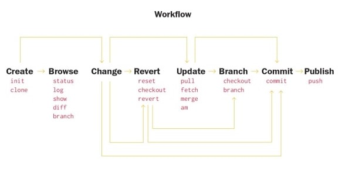

# 
 __Мое руководство по работе с git__ 

  
  

работа с гит
 

## __Осовные команды гита__
___
### __Global settings__
___
- **git version** - Посмотреть версию Git
- **git config --global user.name "*username*"** - Имя пользователя для всех git на рабочей станции
- **git config --global user.email "*user@email*"** - E-mail пользователя
- **git config --list** - посмотреть файл конфига
### __Init repo__
___
- **git init** служит для инициализации репозитория
- **git add <mask_name>** служит для индексации файлов/папок  
- **git status** служит для просмотра статуса индексированных/неиндексированных файлов в репозитории
- **git commit -m "commit_message"** служит для фиксации изменений в репозитории
- **git commit -a -m "commit_message"** если лень делать git add, а зафиксировать изменения надо в *проиндексированных файлах*
- **git checkout <*commit_name*>** перейти к конкретному коммиту
- **git checkout master** - вернуться в ветку *master* на актуальную версию коммита
- **git diff** сравнить изменения
## __Просмотр веток коммитов и изменений__
___
- **git log** служит для просмотра подробного журнала изменений. <kbd>Q</kbd> - выход из журнала
- **git log --pretty=oneline** посмотреть изменения в удобном формате в одну строчку один коммит
- **git log --pretty-short** краткий формат фиксаций
- **git log --graph** - просмотр лога в виде дерева
- **git log <_file_>** - показать фиксации файла
- **git log <_dir_>/** - показать фиксации директории
### __Работа с ветками Git__
___
- **git branch** - вывести все ветки в репозитории, указывает на текущую
- **git merge<_branchName_>** - влить <_branchName_> в текущую
- **git merge --abort** - отменить слияние веток
- **git branch <_branchName_>** - создать ветку *branchName*
- **git rebase <_branch_>** - перенести в ветку
- **git rebase <_main_>** - перенести в главную ветку
- **git rebase --abort** - отменить перенос

